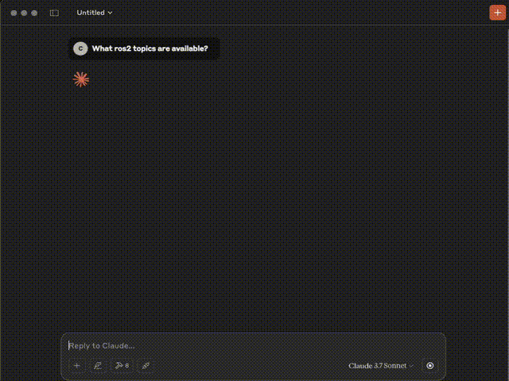

# WiseVision ROS2 MCP Server

[](https://discord.gg/9aSw6HbUaw)

Python server implementing Model Context Protocol (MCP) for ROS2.



# Features
- List available topics 
- List available services 
- Call service
- Get messages from [WiseVision Data Black Box](https://github.com/wise-vision/wisevision_data_black_box) ([influxDB](https://www.influxdata.com) alternative to [Rosbag2](https://github.com/ros2/rosbag2))
- Subscribe topic to get messages
- Publish message on topic
- Echo message on topic
- Get fields from message type


**Note:** To call service with custom service source it before start server.

## API

### Tools

- **ros2_topic_list**
    - Retrun list of available topics
    - Output:
        - `topic_name` (string): Topic name
        - `topic_type` (string): Message topic type

- **ros2_service_list**
    - Retruns list available services
    - Output:
        - `service_name` (string): Service name
        - `service_type` (string): Service type
        - `request_fields` (string array): Fields in service

- **ros2_service_call**
    - Call ros2 service
    - Inputs:
        - `service_name` (string): Service name
        - `service_type` (string): Service type
        - `fields` (string array): Fields in service request filled with user data
        - `force_call` (bool): Force service call without every field in service field up, Default set to false
    - Output:
        - `result` (string): Return result of the service call
        - `error` (string): Return error in case of error
    - Features:
        - Check if service exists
        - Check if every field in service is provide

- **ros2_topic_subscribe**
    - Subscribes to a ROS 2 topic and collects messages either for a duration or a message limit.
    - Inputs:
        - `topic_name` (string): Topic name
        - `duration` (float): How long subscribe topic
        - `message_limit` (int): How many messages collect
        - Default to collect first message, waiting 5 seconds
    - Output:
        - `messages`: Serialized messages from topic
        - `count`: Number of collected messages
        - `duration`: How long messages has been collected

- **ros2_get_messages**
    - Inputs:
        - `topic_name` (string): Topic name
        - `message_type` (string): Message type
        - `number_of_msg`(int): How many messages get from data black box
        - `time_start` (str): Start time for data retrieval. Only messages with timestamps after this will be returned
        - `time_end` (str):  End time for data retrieval. Only messages with timestamps before this will be returned
    - Output:
        - `timestamps`: Time values used to indicate when each message was created, recorded, or received. Typically represented as ISO 8601 strings or UNIX epoch times. Used for filtering, ordering, and synchronizing data.
        - `messages`: Individual units of published data in ROS 2 topics. Each message contains a structured payload defined by its message type (e.g., `std_msgs/msg/String`).

- **ros2_get_message_fields**
    - Inputs:
        - `message_type` (string): Message type
    - Output:
        - Returns the field names and types for a given ROS 2 message request type

- **ros2_topic_publish**
    - Inputs:
        - `topic_name` (string): Topic name
        - `message_type` (string): Message type
        - `data` (dict): Dictionary with message fields
    - Output:
        - `status`: Status of publication


## Usage

### MCP Server Configuration
> [!NOTE]
> The server is running inside a Docker container as the root user. To communicate with other ROS components, they must also be run as root.

> [!NOTE]
> Due to this [issue](https://github.com/microsoft/vscode-copilot-release/issues/7505), this MCP server doesn't work with Copilot in Visual Studio Code.

**Docker run**

Set MCP setting to mcp.json.
```json
"mcp_server_ros_2": {
    "command": "docker",
    "args": [
        "run",
        "-i",
        "--rm",
        "wisevision/mcp_server_ros_2"
    ],
    }

```

### Build docker image locally
```bash
git clone https://github.com/wise-vision/mcp_server_ros_2.git
cd mcp_server_ros_2
docker build -t wisevision/mcp_server_ros_2 .
```


Add  this to AI Agent prompt:
```txt
You are an AI assistant that uses external tools via an MCP server.
Before calling any tool, always check your memory to see if the list of available tools is known.
	•	If you don’t have the current tool list in memory, your first action should be to call the list-tools tool.
	•	Never guess tool names or parameters.
	•	If a user requests something that may require a tool and you don’t have the right tool info, ask them or call list-tools first.
Once the tool list is loaded, you may call tools directly using their documented names and schemas.
```

# Debugging

Since MCP servers run over stdio, debugging can be challenging. For the best debugging
experience, we strongly recommend using the [MCP Inspector](https://github.com/modelcontextprotocol/inspector).

You can launch the MCP Inspector via [ `npm` ](https://docs.npmjs.com/downloading-and-installing-node-js-and-npm) with this command:

```bash
npx @modelcontextprotocol/inspector uv --directory /path/to/mcp_server_ros2 run mcp_ros_2_server
```

Upon launching, the Inspector will display a URL that you can access in your browser to begin debugging.